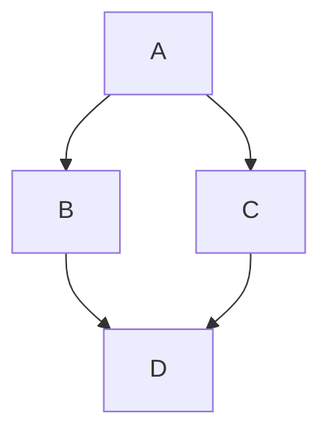

# hello-world

<!-- TO DO: add more details about me later -->
This repository is intended for GitHub steam practice
Hi, I'm Angelina currently beginning to study IT. Interested in Python, Linux and networking.

<details> 
<summary> My top languages</summary>
  
| Rank |  Languages |
|-----:|------------|
|     1| JavaScript |
|     2| Python     |
|     3| SQL        |

</details>

---
```
> The best way to predict the future is to create it
- Peter Drucker
```

---
Here is a simple flow chart:



```mermaid
  info
```
---
```geojson
{
 "type": "FeatureCollections",
 "features": [
   {
    "type": "Feature",
    "id": 1,
    "properties": {
      "ID": 0
    },
    "geometry": {
      "type": "Polygon",
      "coordinates": [
        [
            [-90,35],
            [-90,30],
            [-85,30],
            [-85,35],
            [-90,35]
        ]
       ]
      }
     }
    ]
   }
```
---
```topojson
{
 "type": "Topology",
 "transform": {
   "scale": [0.0005000500050005, 0.00010001000100010001],
   "translate": [100, 0]
 },
 "objects": {
   "example": {
     "type": "GeometryCollection",
     "geometries": [
       {
         "type": "Point",
         "properties": {"prop0": "value0"},
         "coordinates": [4000, 5000]
       },
       {
        "type": "LineString",
        "properties": {"prop0": "value0", "prop1": 0},
        "arcs": [0]
       },
       {
        "type": "Polygon",
        "properties": {"prop0": "value0", "prop1": {"this": "that"}
        },
        "arcs": [[1]]
       }
      ]
     }
    },
    "arcs": [[[4000, 0], [1999, 9999], [2000, -9999], [2000, 9999]], [[0, 0], [0, 9999], [2000, 0], [0, -9999], [-2000, 0]]]
}
```
--- 
```stl
solid cube_corner
  facet normal 0.0 -1.0 0.0
    outer loop
      vertex 0.0 0.0 0.0
      vertex 1.0 0.0 0.0
      vertex 0.0 0.0 1.0
    endloop
  endfacet
  facet normal -1.0 0.0 0.0
    outer loop
      vertex 0.0 0.0 0.0
      vertex 0.0 0.0 1.0
      vertex 0.0 1.0 0.0
    endloop
  endfacet
  facet normal 0.577 0.577 0.577
    outer loop
      vertex 1.0 0.0 0.0
      vertex 0.0 1.0 0.0
      vertex 0.0 0.0 1.0
    endloop
  endfacet
endsolit
```
--- 
